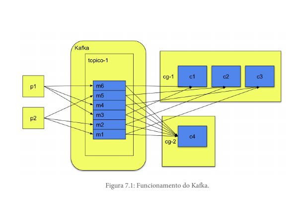

# Diferentes grupos de consumidores

Consumer groups são uma funcionalidade do Apache Kafka que permite que múltiplos consumidores leiam mensagens de um tópico de forma independente. Isso é útil para balancear a carga e possibilitar que diferentes aplicações ou instâncias de uma aplicação processem mensagens em paralelo.

## Exemplo prático

Imagine que temos um tópico chamado `topico-teste` e dois grupos de consumidores: `grupo-1` e `grupo-2`. As mensagens publicadas nesse tópico serão entregues para ambos os grupos. Ou seja, cada grupo recebe todas as mensagens do tópico de forma independente.

Cada grupo de consumidores pode ter múltiplas instâncias (consumidores). Dentro de um mesmo grupo, o Kafka garante que as mensagens sejam distribuídas entre os consumidores de forma que cada mensagem seja processada por apenas um consumidor do grupo. Isso significa que, se tivermos dois consumidores no `grupo-1`, cada um deles receberá metade das mensagens desse grupo.

Resumindo:
- **Mensagens são entregues para todos os grupos de consumidores.**
- **Dentro de um grupo, cada mensagem é processada por apenas um consumidor daquele grupo.**
- **Isso permite escalabilidade e paralelismo no processamento das mensagens.**




Exemplo de uma implementação de um consumidor com um grupo de consumidores:

```java

@Slf4j
@Service
@RequiredArgsConstructor
public class ReceiveKafkaMessage {

	private static final String SHOP_TOPIC_EVENT_NAME
		= "SHOP_TOPIC_EVENT";

	private final ReportRepository reportRepository;

		@Transactional
		@KafkaListener(
				topics = SHOP_TOPIC_EVENT_NAME,//1
				groupId = "group_report")//2
		public void listenShopTopic(ShopDTO shopDTO) {
			try {
		    log.info("Compra recebida no tópico: {}.",
		    		shopDTO.getIdentifier());
		    reportRepository
		    	.incrementShopStatus(shopDTO.getStatus());
			} catch (Exception e) {
				log.error("Erro no processamento da mensagem", e);
			}
		}

}
```

1. **topics**: o nome do tópico que o consumidor irá escutar.
2. **groupId**: o ID do grupo de consumidores.
