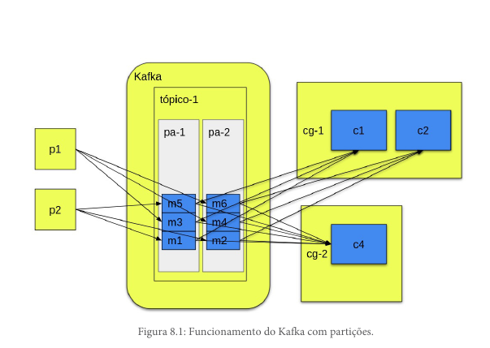

# Paralelizando tarefas

A paralelização de tarefas no Kafka é feita de maneira transparente, sem requerer alterações no código do consumidor ou do produtor. Para isso, o Kafka utiliza o conceito de **partições**. Cada tópico pode ter várias partições, e cada partição pode ser lida por um consumidor diferente. Um consumidor pode ler mais de uma partição, mas uma partição só pode ser lida por um consumidor dentro do mesmo grupo.

> **Observação:** Como o sistema é paralelo, não é garantido que a ordem de entrega das mensagens seja mantida. Isso significa que, se você tiver várias partições e vários consumidores, as mensagens podem ser entregues em uma ordem diferente da que foram enviadas. Existe um conceito de chaves que será abordado no capítulo 9.



Na imagem acima, note que o tópico é formado por duas partições, a `pa-1` e a `pa-2`, e que todas as mensagens da `pa-1` são enviadas para o `c-1`, e todas as mensagens da `pa-2` são enviadas para o `c-2`. Como o tópico possui apenas duas partições, não adiantaria ter mais consumidores, pois eles ficariam ociosos. Note também que as partições não mudam em nada o funcionamento dos produtores, pois quem decide em qual partição uma mensagem será alocada é o Kafka, tornando o processo totalmente transparente para os produtores (no próximo capítulo, veremos o conceito de chaves, que muda um pouco isso).

## Offsets

Todas as mensagens do Kafka dentro de uma partição possuem um **offset**, que nada mais é do que um índice indicando a posição da mensagem na lista de mensagens em uma partição. Esse índice é bastante utilizado pelo Kafka para determinar quais mensagens enviar para um consumidor, pois o Kafka utiliza os offsets para saber qual a última mensagem lida por um grupo em uma partição.

## Rebalanceamento

Quando um consumidor é adicionado ou removido de um grupo, o Kafka faz o rebalanceamento automaticamente das partições entre os consumidores do grupo. Isso significa que as partições são redistribuídas para garantir o balanceamento da carga.

> **Observação:** Quando um tópico é criado e não é definido o número de partições, o Kafka cria uma partição por padrão. Para adicionar mais partições, é necessário remover o tópico e criar um novo com o número de partições desejado. Para isso, podemos usar o comando `kafka-topics.sh`:
```sh
./bin/kafka-topics.sh \
  --create \
  --bootstrap-server localhost:9092 \
  --partitions 6 \
  --topic nome-do-topico
```

> **Quantas partições criar?**
> Não existe um número certo de partições para criar, isso depende bastante da aplicação. Uma recomendação de vários utilizadores do Kafka é criar um tópico com o dobro de partições do que o número esperado de consumidores, assim temos espaço para aumentar o número de consumidores do Kafka caso seja necessário.

## Conclusão

Com essa configuração, basta ter mais de uma instância dos serviços que consomem o mesmo tópico e o Kafka se encarrega de distribuir as mensagens entre os consumidores.
